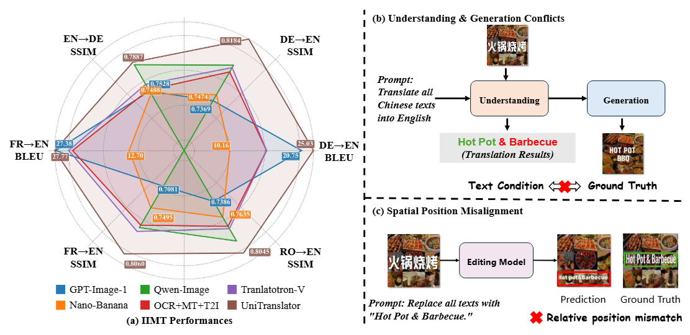
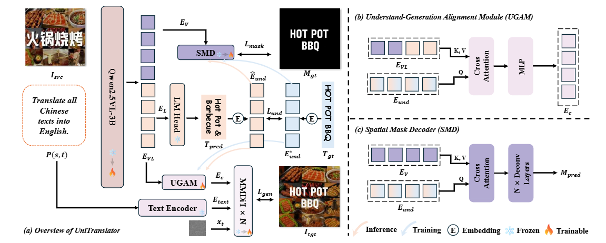
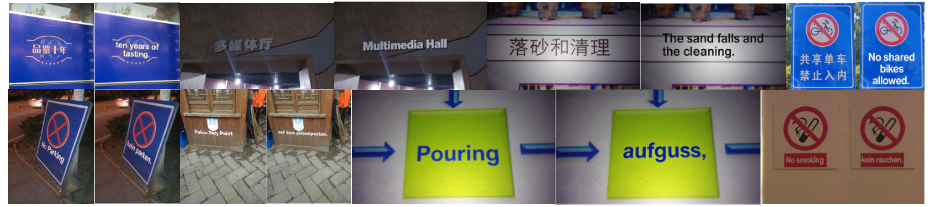
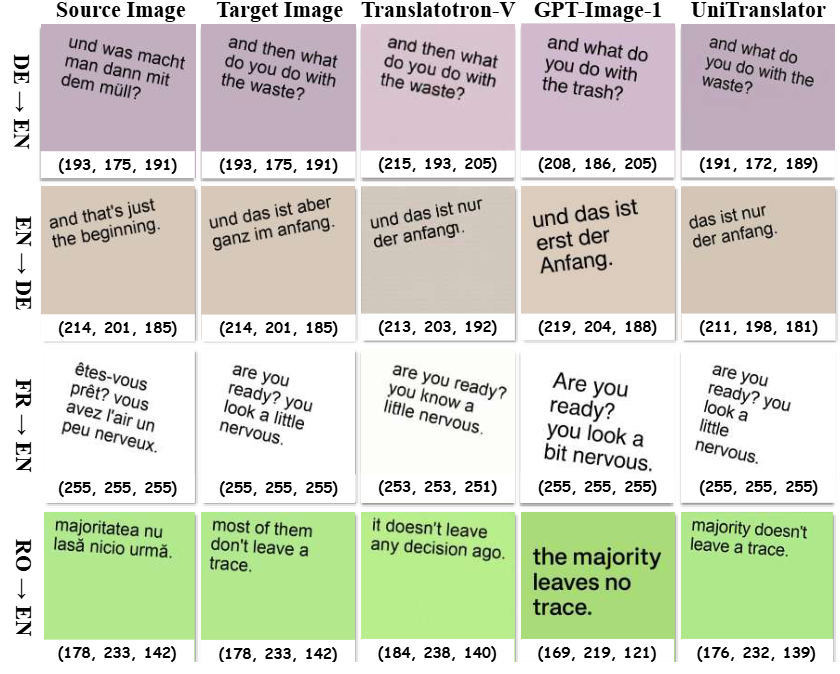

# UniTranslator: A Unified Multi-modal Framework for End-to-end In-Image Machine Translation

<p align="center">
📖 <a href="https://arxiv.org/abs/2606.24333" target="_blank">arXiv</a> · ⭐ <a href="https://github.com/SeerRay-Lab/Unitranslator" target="_blank">GitHub</a>
</p>

## 📰 News

🚀 **[2026-6-18]** Our paper is accepted by ECCV 2026.

🚀 **[2026-6-24]** Our paper is now available on [arXiv](https://arxiv.org/abs/2606.24333) .

🚀 **[2026-6-26]** Our code is now available on GitHub.


## Abstract


In-Image Machine Translation (IIMT) aims to translate scene text in an image and render the translated text back into the original regions while preserving the overall visual appearance. Recent unified multimodal models provide a promising solution by combining visual-text understanding and image generation within a single framework. However, directly adapting such models to IIMT remains challenging. In particular, they often suffer from understanding-generation conflicts, where the translation inferred during understanding is inconsistent with the text supervision used in generation, and spatial position misalignment, where the rendered text does not accurately match the target text regions. To address these issues, we present UniTranslator, a unified multimodal framework for IIMT that tightly couples translation understanding and text editing. Specifically, we introduce an Understand-Generation Alignment Module (UGAM) to bridge the representation gap between understanding and generation, encouraging semantic consistency between translated content prediction and text rendering. We further propose a Spatial Mask Decoder (SMD) with pixel-level supervision over text regions to improve spatial grounding, geometric alignment, and layout controllability during generation. Extensive experiments on multiple benchmarks demonstrate that UniTranslator achieves state-of-the-art performance across diverse language directions and complex real-world layouts. Moreover, our results reveal a strong mutual reinforcement effect between translation understanding and image generation, highlighting the advantage of unified translation-centric multimodal learning. 

## Contribution of UniTranslator




We present UniTranslator, a unified multimodal model for in-image machine translation that integrates translation understanding and visual text editing within a single framework.

We propose an Understand-Generation Alignment Module to mitigate the semantic conflict between understanding and generation, and a Spatial Mask Decoder to improve spatial accuracy in visual text editing through pixel-level supervision.

UniTranslator achieves state-of-the-art results on multiple in-image translation benchmarks, with strong generalization across diverse languages and complex real-world scenes. We further find that translation understanding and image generation reinforce each other during unified training.

## Performance Highlights

- 🏆 Translatotron-V: UniTranslator achieves **25.0** in BLEU (+9.6 than baseline, DE-EN), **0.8184** in SSIM (+3.5% than baseline, DE-EN).
- 🏆 IIMT30k: UniTranslator achieves **16.3** in BLEU and **59.9** in COMET (DE-EN).
- 🏆 PRIM: UniTranslator achieves **13.1** in BLEU and **48.7** in COMET (EN-DE).






## Quick Start

### Installation


```bash
conda create -n univa python=3.10 -y
conda activate univa
pip install -r requirements.txt
pip install flash_attn --no-build-isolation
```

### Preparation

- [Translatotron-V](https://drive.google.com/drive/folders/12r54tAQ98Oxtp6Eb3dvaoiOKzu4lD_7h?usp=sharing) 

- [IIMT30k](https://huggingface.co/datasets/yztian/IIMT30k)

- PRIM
    - [Train set](https://huggingface.co/datasets/yztian/MTedIIMT)
    - [Test set](https://huggingface.co/datasets/yztian/PRIM)

### Usage

1. Before conducting experiments on UniTranslator, please make sure you can run the mask generation and data preparation successfully.

```bash
# Stage1 supervision
python convert_en_de.py

# Stage2 supervision
python convert_transv_mask.py
```

2. Now, you can train the UniTranslator.

```bash
# For Translatotron-V
bash train_stage1.sh
bash train_stage2.sh
```

3. Evaluation

```bash
# Translatotron-V
python eval/structure_bleu.py --generate_dir <pred_img_dir> --ref_dir <gt_img_dir>  --lang <lang>  # Structure-BLEU
python eval/img_eval.py --gen_dir <pred_img_dir> --ref_dir <gt_img_dir>  # SSIM

# IIMT30k & PRIM
python eval/fid_iimt30k.py --test_images_dir <pred_image_dir> --ref_images_dir <gt_image_dir> --gt_text_file <gt_text_file> --lang <language>

```

## Acknowledgement

- [Translatotron-V](https://github.com/XMUDeepLIT/Translatotron-V): An End-to-End Model for In-Image Machine Translation.
- [DebackX](https://github.com/beichenzbc/Long-CLIP.git): In-Image Machine Translation with Real-World Background.
- [PRIM](https://github.com/NVlabs/VILA): Practical In-Image Multilingual Machine Translation.
- [UniWorld](https://github.com/PKU-YuanGroup/UniWorld): UniWorld-V1 is a unified framework for understanding, generation, and editing.


## Citation

Please cite this work if you find it useful:

```bib
@article{lyu2026unitranslator,
    title={UniTranslator: A Unified Multi-modal Framework for End-to-end In-Image Machine Translation},
    author={Jiahao Lyu, Pei Fu, Zhenhang Li, Shaojie Zhang, Jiahui Yang, Can Ma, Yu Zhou, Zhenbo Luo, Jian Luan},
    journal={arXiv preprint arXiv:2606.24333},
    year={2026}
    }
```
